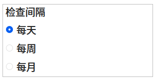

+++
title = "plasma软件更新工具的更新逻辑"
date = 2022-09-22 17:22:51+08:00
[taxonomies]
tags = ["software"]
+++



<!-- more -->

每小时触发一次检查
```js
Timer {
    id: timer
    repeat: true
    triggeredOnStart: true
    interval: 1000 * 60 * 60; // 1 hour
    onTriggered: {
        if (needsForcedUpdate() && networkAllowed && batteryAllowed) {
            PkUpdates.checkUpdates(true /* force */, false /* manual */);
        }
    }
}
```
比较上一次更新所过去的秒数
```js
function needsForcedUpdate() {
    var secs = (Date.now() - PkUpdates.lastRefreshTimestamp())/1000; // compare with the saved timestamp
    if (secs < 0) { // never checked before
        return true;
    } else if (checkDaily) {
        return secs >= secsInDay;
    } else if (checkWeekly) {
        return secs >= secsInWeek;
    } else if (checkMonthly) {
        return secs >= secsInMonth;
    }
    return false;
}
```

[相关源码](https://phabricator.kde.org/source/plasma-pk-updates/browse/master/src/plasma/contents/ui/main.qml)