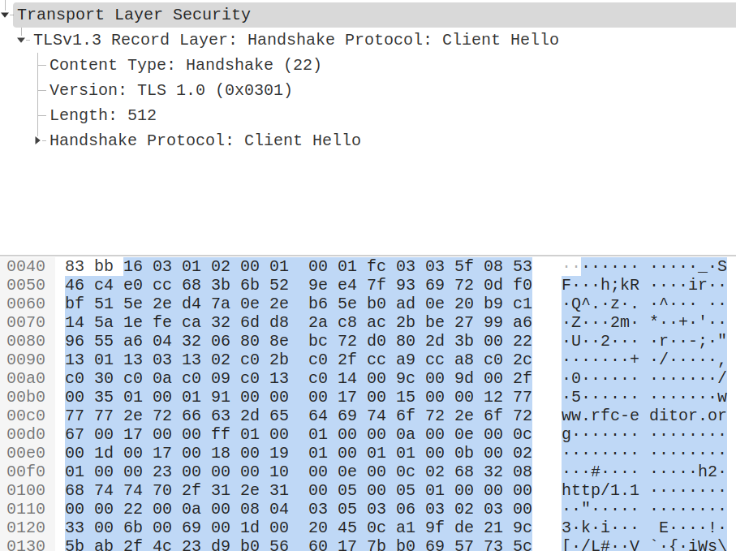
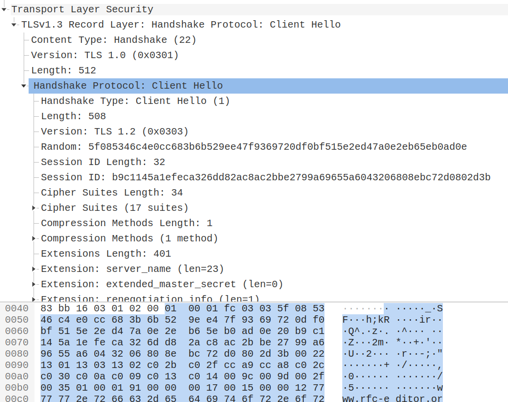
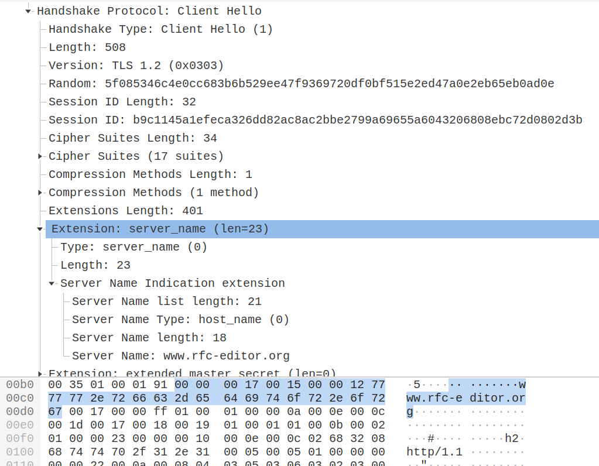
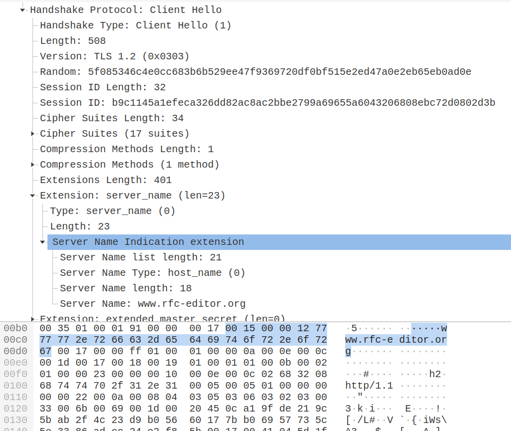

+++
title = "TLS协议中的SNI"
date = 2022-09-25
[taxonomies]
tags = ["TLS","SNI"]
+++

# TLS1.3握手包定义

<!-- more -->
## TLS1.3

```
TLSv1.3 Record Layer: Handshake Protocol: Client Hello
    Content Type: Handshake (22)
    Version: TLS 1.0 (0x0301)
    Length: 512
    Handshake Protocol: Client Hello
        Handshake Type: Client Hello (1)
        Length: 508
        Version: TLS 1.2 (0x0303)
        Random: 5f085346c4e0cc683b6b529ee47f9369720df0bf515e2ed47a0e2eb65eb0ad0e
        Session ID Length: 32
        Session ID: b9c1145a1efeca326dd82ac8ac2bbe2799a69655a6043206808ebc72d0802d3b
        Cipher Suites Length: 34
        Cipher Suites (17 suites)
        Compression Methods Length: 1
        Compression Methods (1 method)
        Extensions Length: 401
        Extension: server_name (len=23)
            Type: server_name (0)
            Length: 23
            Server Name Indication extension
                Server Name list length: 21
                Server Name Type: host_name (0)
                Server Name length: 18
                Server Name: www.rfc-editor.org
        Extension: extended_master_secret (len=0)
        Extension: renegotiation_info (len=1)
        Extension: supported_groups (len=14)
        Extension: ec_point_formats (len=2)
        Extension: session_ticket (len=0)
        Extension: application_layer_protocol_negotiation (len=14)
        Extension: status_request (len=5)
        Extension: delegated_credentials (len=10)
        Extension: key_share (len=107)
        Extension: supported_versions (len=5)
        Extension: signature_algorithms (len=24)
        Extension: psk_key_exchange_modes (len=2)
        Extension: record_size_limit (len=2)
        Extension: padding (len=132)
```

## Record Layer



<details>
<summary>detail</summary>

```
enum {
    invalid(0),
    change_cipher_spec(20),
    alert(21),
    handshake(22),
    application_data(23),
    (255)
} ContentType;

struct {
    ContentType type;
    ProtocolVersion legacy_record_version;
    uint16 length;
    opaque fragment[TLSPlaintext.length];
} TLSPlaintext;
```

</details>

## Handshak - Client Hello



<details>
<summary>detail</summary>

```
enum {
    client_hello(1),
    server_hello(2),
    new_session_ticket(4),
    end_of_early_data(5),
    encrypted_extensions(8),
    certificate(11),
    certificate_request(13),
    certificate_verify(15),
    finished(20),
    key_update(24),
    message_hash(254),
    (255)
} HandshakeType;

struct {
    HandshakeType msg_type;    /* handshake type */
    uint24 length;             /* remaining bytes in message */
    select (Handshake.msg_type) {
        case client_hello:          ClientHello;
        case server_hello:          ServerHello;
        case end_of_early_data:     EndOfEarlyData;
        case encrypted_extensions:  EncryptedExtensions;
        case certificate_request:   CertificateRequest;
        case certificate:           Certificate;
        case certificate_verify:    CertificateVerify;
        case finished:              Finished;
        case new_session_ticket:    NewSessionTicket;
        case key_update:            KeyUpdate;
    };
} Handshake;
```

```
uint16 ProtocolVersion;
opaque Random[32];

uint8 CipherSuite[2];    /* Cryptographic suite selector */

struct {
    ProtocolVersion legacy_version = 0x0303;    /* TLS v1.2 */
    Random random;
    opaque legacy_session_id<0..32>;
    CipherSuite cipher_suites<2..2^16-2>;
    opaque legacy_compression_methods<1..2^8-1>;
    Extension extensions<8..2^16-1>;
} ClientHello;
```

</details>

## Extensions



<details>
<summary>detail</summary>

```
struct {
    ExtensionType extension_type;
    opaque extension_data<0..2^16-1>;
} Extension;

enum {
    server_name(0),                             /* RFC 6066 */
    max_fragment_length(1),                     /* RFC 6066 */
    status_request(5),                          /* RFC 6066 */
    supported_groups(10),                       /* RFC 8422, 7919 */
    signature_algorithms(13),                   /* RFC 8446 */
    use_srtp(14),                               /* RFC 5764 */
    heartbeat(15),                              /* RFC 6520 */
    application_layer_protocol_negotiation(16), /* RFC 7301 */
    signed_certificate_timestamp(18),           /* RFC 6962 */
    client_certificate_type(19),                /* RFC 7250 */
    server_certificate_type(20),                /* RFC 7250 */
    padding(21),                                /* RFC 7685 */
    pre_shared_key(41),                         /* RFC 8446 */
    early_data(42),                             /* RFC 8446 */
    supported_versions(43),                     /* RFC 8446 */
    cookie(44),                                 /* RFC 8446 */
    psk_key_exchange_modes(45),                 /* RFC 8446 */
    certificate_authorities(47),                /* RFC 8446 */
    oid_filters(48),                            /* RFC 8446 */
    post_handshake_auth(49),                    /* RFC 8446 */
    signature_algorithms_cert(50),              /* RFC 8446 */
    key_share(51),                              /* RFC 8446 */
    (65535)
} ExtensionType;
```

</details>

## SNI Extension(Server Name Indication)



<details>
<summary>detail</summary>

```
struct {
    NameType name_type;
    select (name_type) {
        case host_name: HostName;
    } name;
} ServerName;

enum {
    host_name(0), (255)
} NameType;

opaque HostName<1..2^16-1>;

struct {
    ServerName server_name_list<1..2^16-1>
} ServerNameList;
```

The ServerNameList MUST NOT contain more than one name of the same name_type.
</details>

参考
- [The purpose of this presentation language is to document TLS only](https://www.rfc-editor.org/rfc/rfc5246#section-4)
- [TLS1.2 RFC5246](https://www.rfc-editor.org/rfc/rfc5246)
- [TLS1.3 RFC8446](https://www.rfc-editor.org/rfc/rfc8446)
- [Extension Definitions RFC6066](https://www.rfc-editor.org/rfc/rfc6066)